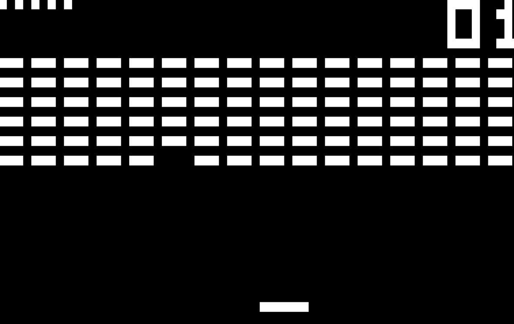
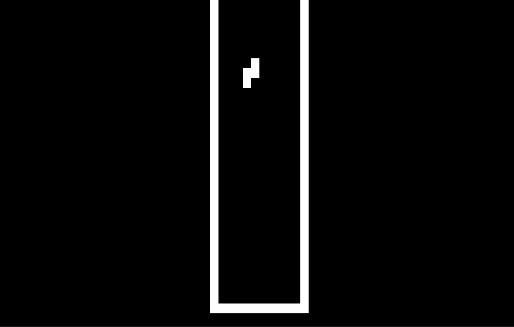

# RCHIP-8
My second attempt at writing a chip-8 emulator from scratch, and also, my first 'big' Rust project.
It's been really fun so far and I've even kind of redeem myself, since [my first CHIP-8 emulator](https://github.com/jmj0502/Chip-8-Emulator) was
kind of difficult to run (the SDL package used required a lot of esoteric practices to work properly).

Initially I tried to rewrite the project using C++. However, I don't consider myself an expert on the language, so I thought it will be easier for me to
write this project in Rust since it is a little more user-friendly than C++ (don't get me wrong, I don't dislike the language), specially when it comes to dealing with dependencies, build tools, etc.

## Images
 


## Features
This project is not done, but multiple games can be played with little to no trouble.
There are certain instructions (specifically, the ones used on the oldest implementations of chip-8)
that I haven't map accurately, so you may experiment some bugs on some games.

### Supported features
* Resizing: The emulator modifies its scale according to the size of the window.
* Save states: The emulator allow you to save and load the current state of a game (Press `F1` to save and `F2` to load).
* Sound: The emulator reproduces the sound of most games appropriately.

### Pending features
* Rewind.
* Config Files
* Fancy UI (something like egui or ImGui will be helpful here).

Since the emulator doesn't have support for config files, you'll have to
use the default key mapping.
```
1 2 3 C     1 2 3 4
4 5 6 D     q w e r
7 8 9 E ->  a s d f
A 0 B F     z x c v
```
## Objective
The main objective of the project was to learn more about low-level development while building something interesting
at the same time. I was able to easily re-grasp most of the concepts used on the project (registers, instruction processing, etc.) and
I'm definitely looking forward to work on similar projects in the future, in order to improve my level of expertise on the subject (I may
even write a gameboy emulator, who knows).

On the other hand, I also wanted to practice my Rust skills (I'm still a newbie tho'). Initially I conceived a different architecture for
the project, since I wanted the Chip8 struct to have different fields that pointed to trait objects that will represent the different CHIP-8 components
(display, audio, etc.). However, such process ended up adding an interesting layer of complexity (the use of the interior mutability pattern, for example), so
I decided to ditch such approach in pro of a simpler one.

## Learning Resources
I used most of the learning resources described on my first implementation, alongside with other
interesting learning resources I found along the way:
* [Tobias V. Langhoff's Guide to making a CHIP-8 emulator](https://tobiasvl.github.io/blog/write-a-chip-8-emulator/)
* [r/EmuDev](https://www.reddit.com/r/EmuDev/)
* [An introduction to CHIP-8 emulation using rust](https://github.com/aquova/chip8-book)
* Multiple CHIP-8 implementations around Github/Gitlab.